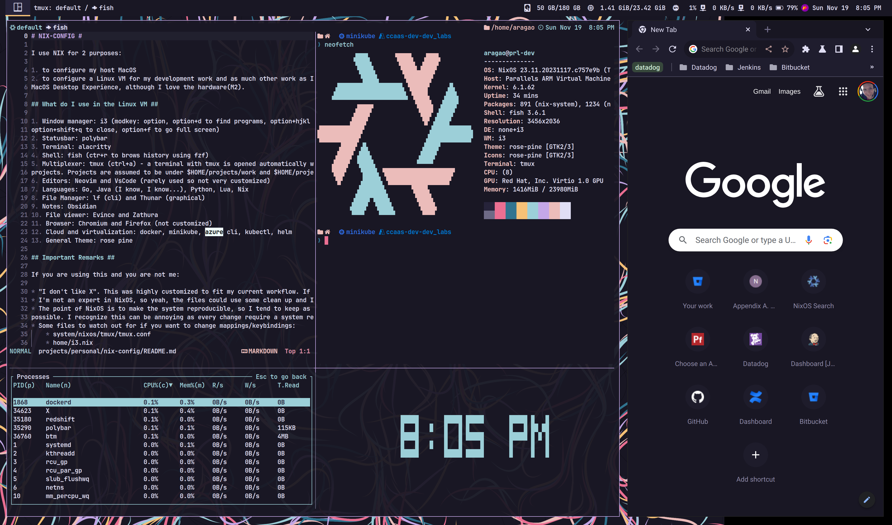

# NIX-CONFIG #

I use nix for 2 reasons:

1. to configure my host MacOS
2. to configure a Linux VM for my development work and any other work I can get away with (not a big fan of MacOS desktop - hardware is top notch though).

## What do I use in the Linux VM ##

1. Window manager: i3 (modkey: option, option+d to find programs, option+hjkl to move around, option+shift+e to exit, 
option+shift+q to close, option+f to go full screen)
2. Statusbar: polybar
3. Terminal: alacritty
4. Shell: fish (ctr+r to brows history using fzf)
5. Multiplexer: tmux (ctrl+a) - a terminal with tmux is opened automatically when the system starts. Ctrl+A+f to find 
projects. Projects are assumed to be under $HOME/projects/work and $HOME/projects/personal. 
6. Editors: Neovim and VsCode (rarely used so not very customized)
7. Languages: Go, Java (I know, I know...), Python, Lua, Nix
8. File Manager: lf (cli) and Thunar (graphical)
9. Notes: Obsidian
10. File viewer: Evince and Zathura
11. Browser: Chromium and Firefox (not customized)
12. Cloud and virtualization: docker, minikube, azure cli, kubectl, helm 
13. General Theme: rose pine

## Important Remarks ##

If you are using this and you are not me:

* "I don't like X". This was highly customized to fit my current workflow. If you plan to use it, I suggest you fork the code.
* I'm not an expert in NixOS, so yeah, the files could use some clean up and I will get ther one day.
* The point of NixOS is to make the system reproducible, so I tend to keep as much configuration under control of nix as 
possible. I recognize this can be annoying as every change require a system rebuild.
* Some files to watch out for if you want to change mappings/keybindings:
    * system/nixos/tmux/tmux.conf
    * home/i3.nix
    * home/neovim/setup/mappings.lua
    * home/neovim/setup/lsp.lua

## Installation ##

### Linux VM ### 

1. Download NixOS minimal ISO from https://nixos.org/download
2. Using UTM or Parallels, create a VM using the downloaded iso
3. Dpi is set to 192, so don't forget to set retina mode
3. > sudo -i
4. > curl -sS https://raw.githubusercontent.com/andreaugustoaragao/nix-config/main/install/nixos.sh|sh
5. answer a few questions throughout the way (destination device, login name, full Name and the root password)
6. > reboot
7. when rebooting, the system will automatically login as the user entered during the install step. Don't forget to set a password
8. after rebooting don't forget to clone this repo under projects/personal
9. if you are having issues with screen resolution (and have set retina mode in the VM configuration), try running
10. >xrandr --output Virtual-1 --auto

## Ideas and inspiration ##

